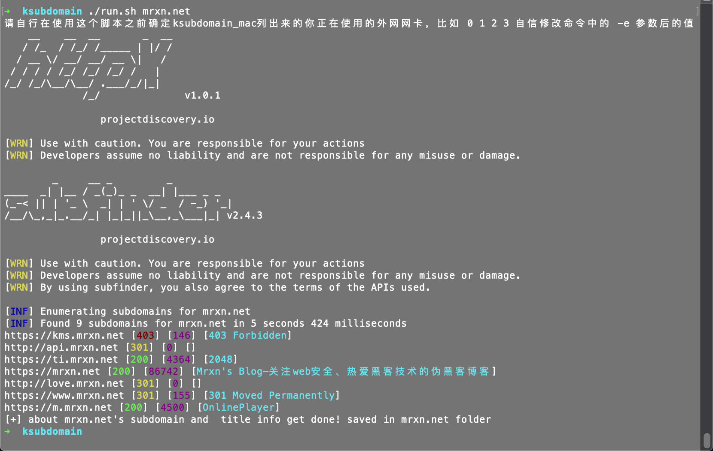
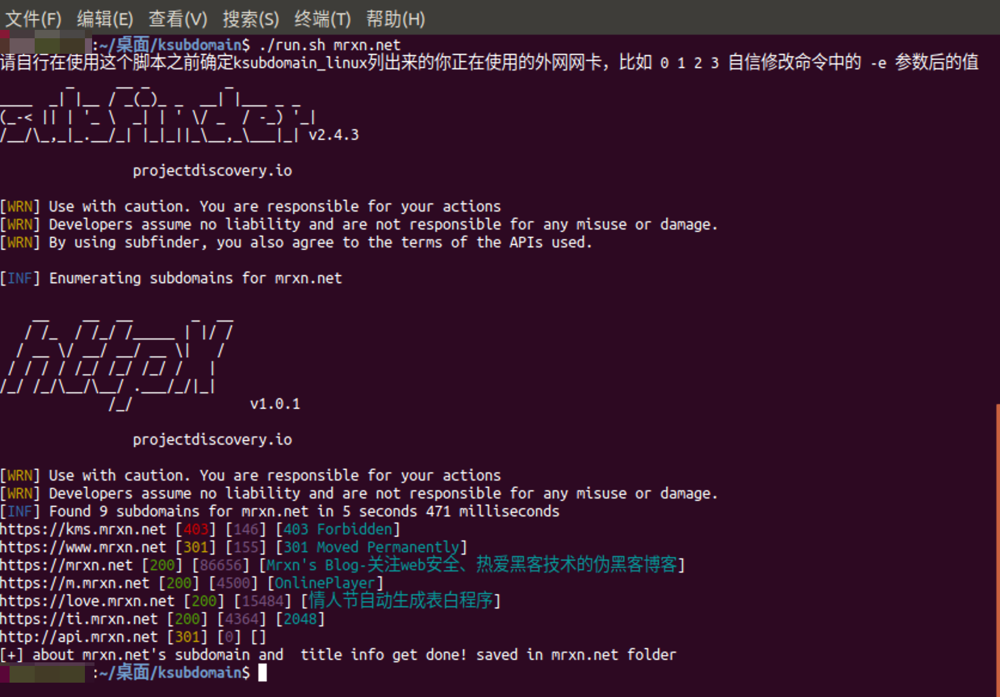

# subdomain_shell

### 一键调用subfinder+ksubdomain_mac+httpx 强强联合 从域名发现-->域名验证-->获取域名标题、状态码以及响应大小 最后保存结果,简化重复操作命令

#### 因为懒 \\-_-\ 不想重复写命令，故诞生此项目
> 暂时只写了个单域名的，后面找时间补上从文件加载多域名脚本
其实加个判断调整下基本上就OK，欢迎各位师傅 pull 啊
后期考虑加上 xray 的主动爬虫 来个简单的从域名到基本信息搜集的过程，可以做成定时任务，再入库？越来越复杂。。。拉闸 暂时先这样

### tested on Mac & Ubuntu

### 食用方法
1.自行下载脚本，准备文件
2.下载我打包好的，下载解压开箱即用[点我下载](https://mrxn.lanzous.com/b01hngsri)

## Mac 脚本测试

### 运行后自动保存结果

## Ubuntu 脚本测试

> :smile_cat: 只需要执行 ./run.sh +domain 即可
> ⚠️ 使用之前，请先下载好系统对应的三个文件，注意别下载错了
> ⚠️ 请自行在使用这个脚本之前确定ksubdomain_mac列出来的你正在使用的外网网卡，比如 0 1 2 3 自信修改命令中的 -e 参数后的值

### 欢迎师傅们完善 pull
### 相关项目 感谢他们的付出
> ### [ksubdomain-无状态子域名爆破工具](https://github.com/knownsec/ksubdomain)
> ### [subfinder-子域名查找工具,可以自行配置API接口，获取更多更全面的子域名](https://github.com/projectdiscovery/subfinder)
> ### [httpx-快速获取域名标题、状态码、响应大小等等信息](https://github.com/projectdiscovery/httpx)

